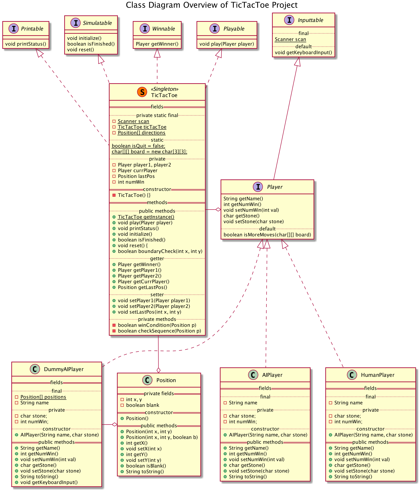

# TicTacToe

## Contents

- 틱택토 게임 구현하기 - [틱택토 레퍼런스](https://ko.wikipedia.org/wiki/%ED%8B%B1%ED%83%9D%ED%86%A0)
  - 틱택토 게임을 UML로 설계하고 Java로 구현

- Feature: AI Player
  - 절대 지지않는 AI Player를 구현
    
## Class Diagram Overview of TicTacToe Project

## Class Diagram of TicTacToe class 

## Class Diagram of Player interface

## Class Diagram of HumanPlayer class

## Class Diagram of DummyAIPlayer class

## Class Diagram of AIPlayer class

